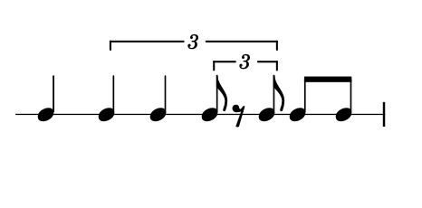

# NTN Specification

## Data Token

A data token is a series of one or more accepted data token characters.

It cannot begin with a number.

### Accepted Data Token Characters

`abcdefghijklmnopqrstuvwxyz`
`ABCDEFGHIJKLMNOPQRSTUVWXYZ`  
`0123456789`  
`~_-.|`  

### Example Data Tokens

a  
~a6_b6   
x0000DEAD   
a.b.c.d  
-9.1_6.5  

## Node

A node is he building block of Nested Tuplet Notation.

A series of whitespace separated data tokens.

(a a a a)

## absolute

((3 a a (3 a . a) a (2 a 2(a a))

## Ratio

% LilyBin
\score {
  {
    \new RhythmicStaff {
	    \omit BarLine
      \once \override Staff.TimeSignature #'stencil = ##f
	    c4 \tuplet 3/2 { c c \tuplet 3/2 { c8 r c } } c c
    }
  }
  \layout{}
  \midi{}
}
