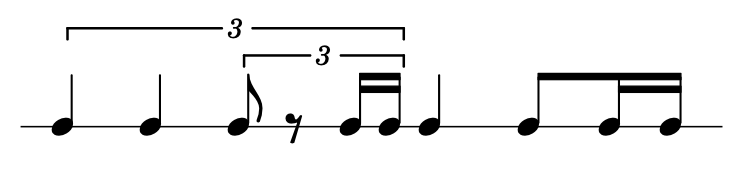

[](https://travis-ci.org/pelevesque/NTN-parser)
[](https://coveralls.io/github/pelevesque/NTN-parser?branch=master)
[](https://standardjs.com)

# NTN-parser

A parser for NTN (Nested Tuplet Notation).

NTN (Nested Tuplet Notation) is a file format for storing events in time
using nested tuplets.

It is the brainchild of Luc St-Louis.

## Example

An example is worth a thousand words.

if `a` = note, and `.` = rest, the following encodings are similar:

1) `((3 a a (3 a . (2 a a))) a (2 a (2 a a)))`

2) 

## Node Repository

https://www.npmjs.com/package/NTN-parser

## Installation

`npm install NTN-parser`

## Tests

### Standard Style & Unit Tests

`npm test`

### Unit Tests & Coverage

`npm run cover`

## Usage

### Requiring

```js
const parse = require('NTN-parser')
```

### Parameters

```js
notation (required)
options  (optional) default = { timeOffset = 0, timeSpan = null }
```

### Basic Usage

```js
const notation = '(C4 G4 (2 F4 E4 D4))'
const result = parse(notation)
result === [
  { time: 0,     data: "C4" },
  { time: 0.25,  data: "G4" },
  { time: 0.5,   data: "F4" },
  { time: 0.666, data: "E4" },
  { time: 0.833, data: "D4" },
  { time: 1,     data: "$" }
]
```

### Options

#### timeOffset

Changes the notation's time offset.

```js
const notation = '(C4 G4 (2 F4 E4 D4))'
const result = parse(notation, { timeOffset: 2 })
result === [
  { time: 2,     data: "C4" },
  { time: 2.25,  data: "G4" },
  { time: 2.5,   data: "F4" },
  { time: 2.666, data: "E4" },
  { time: 2.833, data: "D4" },
  { time: 3,     data: "$" }
```

#### timeSpan

Changes the notation's time span.

```js
const notation = '(fly hog (2 cat dog elk))'
const result = parse(notation, { timeSpan: 5 })
result === [
  { time: 0,     data: "fly" },
  { time: 1.25,  data: "hog" },
  { time: 2.5,   data: "cat" },
  { time: 3.333, data: "dog" },
  { time: 4.166, data: "elk" },
  { time: 5,     data: "$" }
]
```
